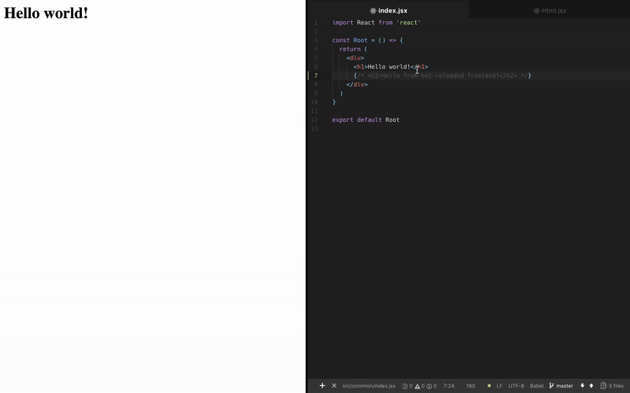

# Tiny-universal-skeleton

> ### If you want advanced starter with this feature -> take a look at [SUIcrux](https://github.com/Metnew/suicrux)!



Imagine that you have server, development server and client app:

- **Server** - your server _middlewares_, _api endpoints_ and _SSR_.
- **Development server** - express server with `webpack-hot-middleware` and `webpack-dev-middleware`.
- **Client** - your frontend. (e.g. React app).

**Main problem**: sync **server middlewares** with **client** and don't lose **power of webpack-(dev|hot)-middleware.**

##### Typical use case
**Your server has middleware that checks is a user logged in and use this info later for SSR.**

> There are other solutions like [universal-webpack](https://github.com/catamphetamine/universal-webpack).<br>
> I'm not sure what's going on inside `universal-webpack` and can it solve the described above problem. But it **looks complicated**.

> In case of a bug inside a complicated software with low community support you'll be the one person who cares about this bug.

This solution is **very-very simple**. But it's not the best, of course.
> 99.9% of universal starters/frameworks run 2 process on 2 ports with 2 different FS. We run only one process on one port with the same FS.

TL;DR:

1. Server entry **should export function that decorates server with all middlewares**, api endpoints, ssr. _Except dev middlewares._
2. Compile **both server and client with Webpack**.
3. Get **compiled decorator** for server and **decorate your dev server**. _DevServer = express server with development middlewares._
4. ????????????
5. Every time your code changes, webpack recompiles your code and decorates your server with newly compiled code.

## Server Entry (src/server/index.js)

```javascript
import express from 'express'
import chalk from 'chalk'

const app = express()
const PORT = 3000
const isProduction = process.env.NODE_ENV === 'production'
const pathToServerDecorator = isProduction
    ? './decorator'
    : '../../webpack_config/devServer'
// NOTE: Such dynamic imports is a bad practice!
// It's used here to show that our `serverDecorator` is a dynamic thing.
const serverDecorator = require(pathToServerDecorator).default
serverDecorator(app)

app.listen(PORT, () => {
    console.log(chalk.green(`SERVER IS LISTENING ON ${PORT}`))
})
```

Did you notice `serverDecorator()` function? Let's figure out what's the hack is it:

## Main server decorator (src/server/decorator.js)

This function decorates express server instance with your middlewares, API and SSR stuff. (e.g. makes your server _yours_) We require this function to decorate our server in production.

```javascript
import addMiddlewares from './middlewares'
import API from './api'
import SSR from './ssr'

/**
 * Mount API, SSR and middlewares to app.
 * @param  {Object} app - Express server instance
 * @return {Object}     - Decorated server instance
 */
export default function (app) {
    // Add global middlewares
    addMiddlewares(app)
    // Add API
    app.use('/api/v1', API)
    // Add SSR
    app.use(SSR)
    return app
}
```

## Server decorator in development (webpack_config/devServer.js)

TL;DR: after every compilation we remove already applied middlewares from Express app (from middlewares stack) and apply new ones.

In development our server decorator looks like:

```javascript
// NOTE: Every time we apply our compiled code to development server
// We add new middlewares from new code, but don't remove old middlewares from old code
// Number of middlewares that our app should have
let prevSize = null
/**
 * @desc Adds dev middlewares + your code to an express server instance
 * @param {ExpressServer} app - Express dev server to which compiled code will be applied
 */
export default function (app) {
    /**
     * @desc Function that executes after your server-side code compiles
     * @param  {Function}  serverSideCode - compiled server-side code
     */
    const done = serverSideCode => {
        // Get current stack of the app (e.g. applied to Express server middlewares)
        const {stack} = app._router
        // get current lenght of stack
        const {length} = stack
        // When we run server first time we don't have any applied middlewares from compiled code
        prevSize = prevSize || length
        if (length > prevSize) {
            // TL;DR: Remove already compiled code
            // That means that we already applied our code to devServer
            // And we can remove already applied middlewares from the last compilation
            app._router.stack = stack.slice(0, prevSize)
        }
        // Apply newly compiled code to our app
        serverSideCode(app)
    }

    // webpack Compiler for server
    const serverCompiler = compiler.compilers.find(
        compiler => compiler.name === 'server'
    )
    // webpack Compiler for client
    const clientCompiler = compiler.compilers.find(
        compiler => compiler.name === 'client'
    )
    // Add webpack-dev-middleware
    app.use(devMiddleWare)
    // Add webpack-hot-middleware
    app.use(
        webpackHotMiddleware(clientCompiler, {
            log: console.log
        })
    )
    // Run `done` function after serverCompiler emits `done` event with a newly compiled code as argument
    webpackGetCodeOnDone(serverCompiler, done)
}
```

## Bundle server with Webpack

I don't want to argue about **"Is it ok to bundle server-side code with Webpack?"** Shortly, **it's a great idea.** 
**Main features**: 
- tree-shaking, 
- code optimizations, 
- high configuration possibilities with `webpack.DefinePlugin()`. 

**Main cons**: it's hard to work with dirs, because webpack supports `__dirname` not as you expected. But it's easy to solve this problem with webpack `alias`. Read more in webpack docs.

### Webpack.config

Your webpack.config.js for server may looks like:

```javascript
import path from 'path'
import fs from 'fs'
import webpack from 'webpack'

const isProduction = process.env.NODE_ENV === 'production'
const distPath = 'my/dist/path'
// NOTE: Notice these lines also:
const entry = isProduction
    ? path.join(config.srcPath, './server')
    : path.join(config.srcPath, './server/server')

// Read more about Webpack for server, if you don't know what this lines do.
let nodeModules = {}
fs
    .readdirSync('node_modules')
    .filter(x => {
        return ['.bin'].indexOf(x) === -1
    })
    .forEach(mod => {
        nodeModules[mod] = 'commonjs ' + mod
    })

const baseWebpackConfig = {
    name: 'server',
    entry,
    target: 'node',
    output: {
        path: path.join(distPath, './server'),
        filename: 'index.js',
    // NOTE: You should add this line:
        libraryTarget: 'commonjs2'
    // If you didn't add info about "libraryTarget", setup will not work.
    // You should add `libraryTarget` property in dev mode
    // it's not a must to have `libraryTarget` in production
    },
    externals: nodeModules,
    node: {
        __dirname: true,
        global: true
    }
}

export default baseWebpackConfig
```

There are 2 strange things inside our webpack config:

##### `"libraryTarget"`
`"libraryTarget"` must be `"commonjs2"`. (Please, be sure that you didn't forget to set libraryTarget in development!)
##### Dynamic `"entry"`
As you already know:
**in dev** we use server decorator and decorate our **development(!) server**.
**for production build** we use server decorator to **decorate our server**.

### Summary

You can easily make your universal app hot-reloaded in few lines of code.    
Performance is good, there are no benchmarks and comparisons, but it works well even on huge projects.

### License

Apache 2.0 License

### Author

Vladimir Metnew [vladimirmetnew@gmail.com](mailto:vladimirmetnew@gmail.com)
